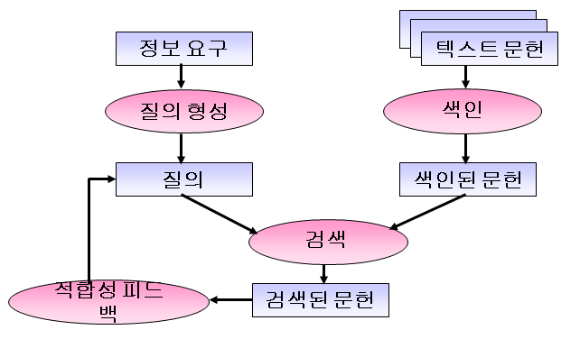
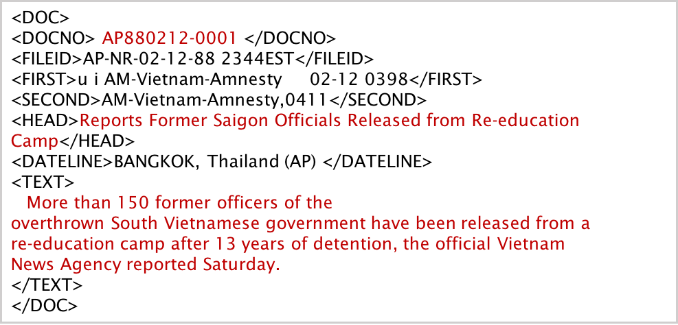
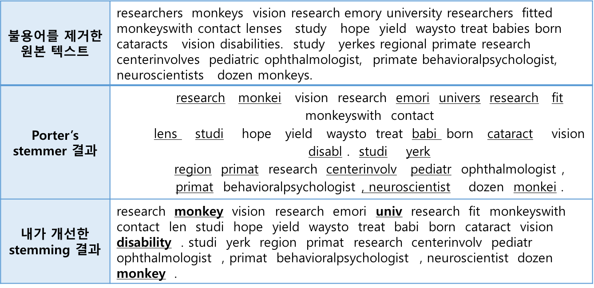
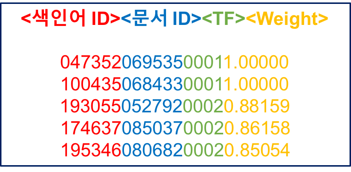
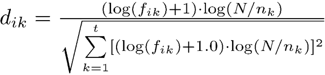
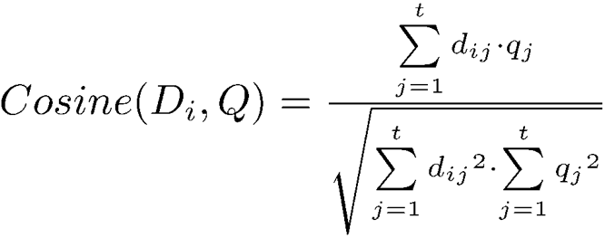
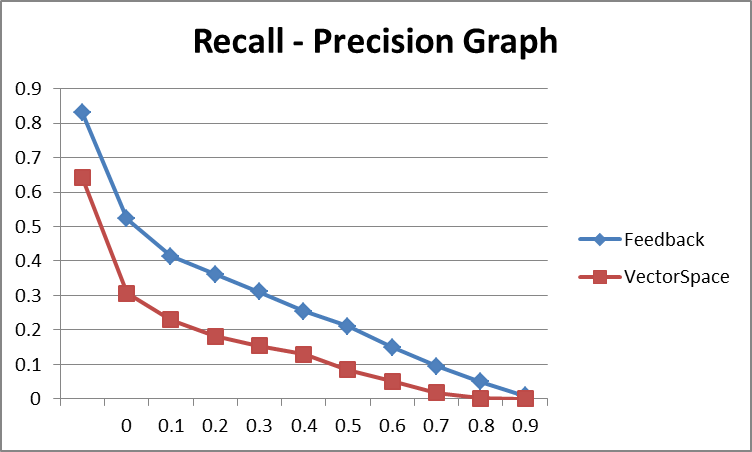
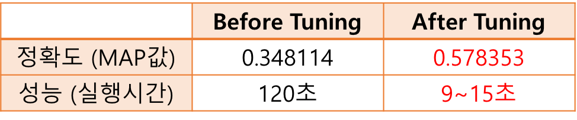

Information-Retrieval-System
================
쿼리가 주어졌을 때, 600MB의 영어 뉴스 기사 집합에서 각 topic에 맞는 적절한 문서들을 검색해 내는 시스템이다.
고전적인 모델인 TF-IDF와 더불어 Vector Space model, BM25 등을 구현하였다. 

#### Implementation
- Language: C++
- Tool: Visual Studio 2012

### Process
  [1. Stemming](#1-stemming)
 
  [2. Build Index Structure](#2-build-index-structure)
 
  [3. Implement Retrieval Model](#3-implement-retrieval-model)
 
  [4. Evaluate Search Engine](#4-evaluate-search-engine)
 
  [5. Tuning and Result](#5-tuning-and-result)
  
****
## Overview
<p align="center">
   </img>
</p>

## 1. Stemming
영어 문서 검색 엔진 구현을 위해 주어진 파일에서 문서를 추출하여 stemming을 수행한다. 
먼저 기사를 추출하고, stopword를 제거한 후, stemming을 진행할 것이다.

본 프로젝트를 위해 주어진 dataset은 1988년부터 1990년까지의 AP 통신의 242,918개(약 600MB)의 뉴스 기사이다.
주어지는 형태는 아래 그림과 같고, 그림에서 붉은 색 글씨로 표시한 부분만이 유익한 정보를 담고있기 때문에, 본 부분만 추출해서 검색하는데 쓰인다.
<p align="center">
   </img>
</p>

### - 기사 추출
주어진 뉴스 기사 자료에서 문서 번호(DOCNO), 기사 제목(HEAD), 기사 내용(Text)을 추출하고, 나머지 불필요한 부분은 제거한다.

### - 불용어 제거
문서에서 빈번히 출현하는 단어(ex. is, the, a, ...)들은 주제와는 관련이 없다. 이러한 단어들을 불용어(stopword)라고 하며, 
뒤에서 인덱스 정보를 추출하기 이전에 불용어를 제거한다.

### - Stemmer 구현
추출된 각 기사에 있는 단어들을 어간만 남기고 나머지는 제거하는 것을 Stemming이라고 한다. 
한 단어가 단수형, 복수형, 과거형, 분사형 등 여러 형태로 나타나기 때문에 stemming을 통해 어간만을 남겨, 한 단어를 한가지 형태로 표현해줘야만 관련 문서를 찾을 때 정확도를 높일 수 있다.
본 프로젝트에서는 Porter stemmer를 기본적으로 이용하였지만, Porter stemmer의 단점을 개선하여 더 좋은 성능의 stemmer를 구현하였다.

> Stemmer 개선 방법
>	```
> porter2 stemmer를 참고하여, porter stemmer에서 처리되지 않았던 부분을 보완하였다.
> ex) y를 ie/i로 바꾸는 룰, us로 끝나는 단어에 대한 룰, ies->i/ie로 바꾸는 룰 등 추가
>	```

내가 구현한 stemmer의 결과의 일부는 아래 표에서 확인할 수 있다. 첫번째 행은 기사 추출 후 불용어을 제거했을 때의 모습이고, porter's stemmer를 적용하고 나면, 
두번째 행에서 밑줄 친 단어들처럼 어간만 남겨준다. 마지막 행은 내가 개선하여 적용하였을 때의 결과를 보이고 있다. 이전 방식에서 처리해주지 못했던 부분을 추가적으로
수정한 것을 확인할 수 있다.
<p align="center">
  </img>
</p>

## 2. Build Index Structure
이제 전처리를 끝낸 기사의 색인 정보를 추출하고 색인 구조를 구축한다.

사용자가 요청한 정보(query)가 들어 있는 문서를 찾기 위해서는 각 정보가 어떤 문서에 들어 있는지를 미리 조사, 정리하는 
과정이 필요하다.

정보 검색에서는 일반적으로 정보의 단위가 단어이므로, 결국 각각의 단어가 출현한 문서가 어떤 것들이 있는지 조사하여 구조화하는
작업이 필요하다. 작업한 내용과, 만든 파일들은 아래와 같다. 구조화한 결과물은 단어정보파일, 문서정보파일, 그리고 역색인 파일이다.

#### - 색인어 및 문서의 ID 설정
역색인 파일에서 색인어 문자열ㅇ르 그대로 이용할 경우, 각 색인어마다 요구하는 메모리의 양이 다르기 대문에 파일 접근에 어려움이
있고, 글자 하나씩 모두 비교해야 하기 때문에 비효율적이다. 따라서, 나는 색인어와 문서 명에 대해 고정된 길이의 ID를 부여하였다.

#### - TF (Term Frequency)
어떤 문서에서 어떤 단어가 출현한 빈도를 기록한다.

ex) \<문서 번호\>\<단어\>\<출현빈도\>

#### - DF (Document Frequency)
특정 단어가 출현한 문서의 수를 기록한다.

ex) \<단어\>\<단어가 출현한 문서 수\>

#### - CF (Collection Frequency)
특정 단어가 전체 문서 집합에서 출현한 빈도를 기록한다.

ex) \<단어\>\<출현 빈도\>

#### - 단어정보파일
이는 파일로 저장하는데, 앞에서 소개한 DF와 CF를 이용하여 구축한다. 이 파일은 [Word.txt](/2-TFIDF/Word.txt)에 해당한다.

형식: \<색인어 ID, 색인어, DF, CF, 역색인에서의 해당 색인어 시작 위치\>

#### - 문서정보파일
문서의 길이는 검색 모델에서 각 문서들을 표현하는 모델을 구하기 위해 필요하다. 이 파일은 [Doc.txt](2-TFIDF/Doc.txt)에 해당한다.

형식: \<문서 ID, 문서 명, 문서 길이\>

#### - 역색인 파일
정보 검색 시스템에서 문서의 수가 계속해서 늘어남에 따라 역색인 데이터 역시 계속 증가하기 때문에 메모리에 저장할 수 없다.
따라서 역색인 데이터를 파일로 저장해두고, 검색할 때 파일을 참조해서 검색을 수행해야 한다.
시작 위치와 해당 색인어가 등장한 문서의 개수(DF), 그리고 역색인 정보에서 레코드 하나당 차지하는 byte개수를 알면, 전체 역색인
정보 파일에서 우리가 필요로 하는 색인어 정보 레코드 위치는 다음과 같이 알아낼 수 있다. 

> 색인어 정보 레코드 위치
>    ```
>    해당 역색인 정보가 저장되어 있는 파일 내부 위치 = 역색인 정보 시작 위치 + (색인어 시작 위치 * 레코드 byte 수)
>    해당 역색인 정보가 저장되어 있는 파일 파일 내부의 양 = 해당 색인어의 DF * 레코드 byte 수
>    ```
이를 토대로, TF, CF, DF, 문서 길이를 이용하여, 검색 엔진에서 사용할 수 있는 색인 파일을 만든다. 형식은 아래 그림과 같다.
<p align="center">
  </img>
</p>

형식에서 term weight란 각 문서에 나타난 단어들의 가중치를 의미하는데 이는 아래 TF-IDF계산식에 의해 구한다. 식의 구체적인 의미는 [여기](https://en.wikipedia.org/wiki/Tf%E2%80%93idf)에서 소개된다. 이 작업으로 만들어진 index파일은 용량문제로 git에 업로드하지 못했다.
<p align="center">
  </img>
</p>

## 3. Implement Retrieval Model
위에서 구현한 단어정보파일, 문서정보파일, 그리고 역색인 파일을 이용해서 실제 검색 기능을 구현하였다. 쿼리가 발생했을 때, 그 요구에 적합한 정보를 찾는
작업이 필요하다.
여기서는 25개의 topic 자료를 주어졌다. 우리는 각 topic에 맞는 기사들을 찾아내면 된다.
<p align="center">
  </img>
</p>
topic자료는 위와 같은 형태로 주어지기 때문에, 앞에서처럼 전처리 과정이 필요하다.

입력된 topic의 유용한 부분(title, desc, narr 등)만을 추출하여 불용어를 제거하고, stemming을 진행하여 검색할 수 있는 형태로 변환, 정렬한다. Vector Space Model에서 사용되는 similarity 계산식은 아래와 같다.
<p align="center">
  </img>
</p>

변환된 쿼리 벡터와 각 문서 벡터와의 유사도(Cosine similarity)를 사용한  Vector Space Model을 구현하여, 쿼리와 유사도가 높은 기사 top10개를 추출하였다.
<p align="center">
  </img>
</p>
위 그림은 각 쿼리 번호와, 전처리를 거친 query의 형태, 그리고 구현한 모델로 해당 쿼리와 유사도가 가장 높은 문서 10개를 출력한 모습이다.

## 4. Evaluate Search Engine
이제 전반적인 모든 과정은 끝났다. 하지만, 성능을 측정하고 모델을 개선하여 더 나은 퍼포먼스를 이끌어내는 작업을 진행하였다.

여기에서는 사용자 적합성 피드백(Relevance Feedback)이 주어졌다고 가정하였다. 즉, 사람이 직접 해당 topic에 대해 적합한 문서라고 분류한 정보가 주어지면,우리가 구현한 모델에 이 정보를 더하여 오류를 줄여가는 방식이다.

구체적으로, 적합한 문서를 나타내는 평균 벡터와 적합하지 않은 문서를 나타내는 평균 벡터의 차이를 극대화하는 방식으로 본 프로젝트에서는 [Rocchio algorithm](https://en.wikipedia.org/wiki/Rocchio_algorithm)을 사용하였다.

간단하게 얘기하자면 쿼리의 가중치를 변화시키는 것인데, 만약 해당 쿼리 문서의 단어가 적합하다고 판별된 문서에 나왔다면
가중치는 더해지고, 적합하지 않다고 판별된 문서에 나왔다면 가중치는 작아질 것이다. 
이는 초기 검색된 문서를 기준으로 다시 가중치를 주는 것이므로 검색 모델의 성능이 더 나아질 것이라 예상하였다.

실험 결과, 각 topic마다 관련 기사 200개씩을 검색해내고 topic 25개 모두에 대해 성능을 측정해보았을 때, 성능 변화는 아래 그래프에서 보이다시피 더 향상된 것을 볼 수 있었고, MAP값 또한 0.206에서 0.348로 증가하였다.
<p align="center">
  파란선: Relevance Feedback적용하였을때 ,빨간선: 단순 VSM모델만 사용하였을 때
  </img>
</p>

## 5. Tuning and Result
마지막으로 구현한 검색엔진의 정확도를 높이고, 검색시간을 단축하기 위해 전체적인 tuning을 진행하였다.

### 정확도 개선
- 쿼리의 TF 계산 시 단순 빈도수가 아니라 log(빈도수)+1로 계산
- Relevance Feedback을 적용한 Vector space model에서 **BM25**로 모델 변경
- BM25에서 사용되는 파라미터 조정

### 시간 개선
- RBtree를 이용한 map 대신 Hashmap을 이용한 unordered_map으로 변경
- map 사용시 Key를 string 대신 ID(int) 사용
- index.dat에 접근하여 읽는 방식 변경
- 계산량이 많은 Vector space model에서 계산량이 적은 BM25로 모델 변경

개선시 가장 공을 많이 들였던 부분은 시간이었다. 데모를 할 때 time limit을 빡빡하게 줘서 자칫하다간 0점 맞을 수도 있다고 판단되어 냉큼
모델을 아예 바꿔버렸다. 그 외에도 온갖 자잘한 구조까지 하나하나 바꿔 시간 낭비를 조금이라도 더 줄이기 위해 노력하였다.

그 결과, 25개의 쿼리에 대해 각 200개씩의 관련 문서를 추출하는 데까지 120초(..비정상이었다..인정한다..)가 걸리던 작업을 **9~15초**대로 대폭 줄였다.

정확도 또한 확연하게 높아졌다. 아래 표에서 보이다시피 MAP값이 0.348에서 0.578로 **66%** 가량 향상되었다.
<p align="center">
  </img>
</p>
